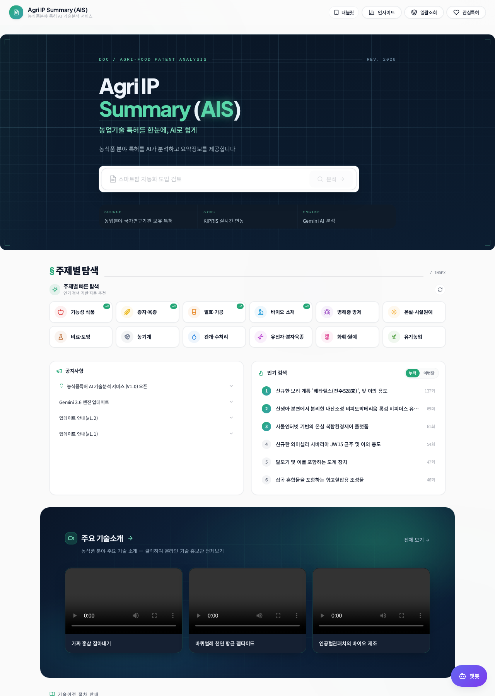
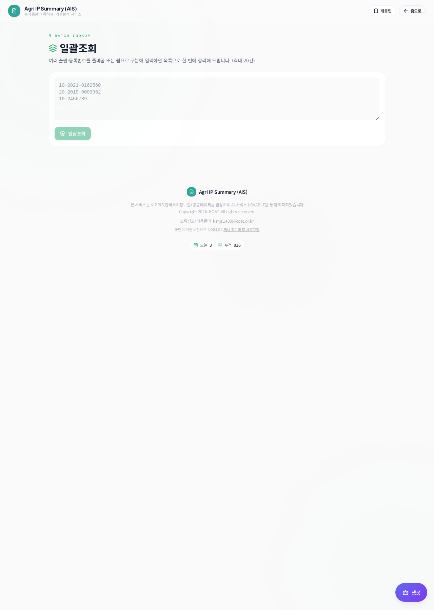

# Patent AI Summary Platform — 범용 이식 스킬

공공기관 보유 특허를 AI로 검색·요약·평가·규제분석하고 웹/PDF/MCP로 제공하는
**Agri IP Summary (AIS)** 아키텍처를, 다른 기관·다른 기술분야에 그대로 이식하기 위한 스킬입니다.

---

## 1. 사용법

### 자동 적용
"보건의료 기관용으로 이 서비스 만들어줘", "출원인 범위를 ○○원으로 바꿔줘",
"다른 분야 특허 분석 서비스로 포팅해줘" 같은 요청이 오면 Lovable이 자동으로 이 스킬을 참조합니다.

### 직접 호출
채팅 입력창에 `/` 를 입력하거나 왼쪽 하단 **+ 버튼 > Add skill** 에서 선택합니다.

### 대표 프롬프트 예시
```
/patent-ai-summary-platform
한국해양과학기술원 보유 특허 대상으로 동일 구조의 서비스를 구성해줘.
키워드 카테고리는 소재/공법/해역/효과, 규제는 해양환경관리법 계열로.
```

### 이식 절차(요약)
| 단계 | 작업 | 참고 문서 |
| --- | --- | --- |
| 1 | 기관 스코프(출원인 화이트리스트) 교체 | `references/domain-config.md` |
| 2 | 도메인 키워드 사전·오탐 가드 교체 | `references/domain-config.md` |
| 3 | 사업화 평가 루브릭 재조정 | `references/scoring.md` |
| 4 | 규제 매핑(법령 도메인) 교체 | `references/pipeline.md` |
| 5 | 브랜딩(서비스명·부제·메타·MCP명) 변경 | `references/domain-config.md` |
| 6 | 엣지 함수 배포 + MCP 매니페스트 재생성 | `references/mcp.md` |

---

## 2. 주요 기능

| 기능 | 설명 |
| --- | --- |
| 특허 검색 | 키워드 / 발명자명 / 특허번호, IDF 랭킹, 거절·소멸 건 제외 |
| AI 요약서 | 핵심기술·해결문제·해결수단·정량효과·활용분야·시장동향 스트리밍 생성 |
| 사업화 점수 | 기술성·시장성·사업성 3축 + TRL 9단계, 특허번호 기준 점수 고정 |
| 규제 분석 | 국가법령정보 API 연동, 사업화 시 예상 규제 매칭 |
| 유사특허 추천 | 의미 기반 유사 특허 + 매칭 사유 |
| PDF 다운로드 | 러닝헤드·폴리오·북마크를 갖춘 편집 조판형 요약서 |
| 일괄조회 | 최대 20건 동시 입력, 좌측 목록 / 우측 요약서 분할 뷰 |
| MCP 서버 | 6개 도구를 외부 AI 에이전트에 OAuth로 제공 |

---

## 3. 화면 이미지

### 메인 (검색 · 주제별 탐색 · 인기검색어)


### 일괄조회 (분할 뷰)


---

## 4. 시스템 구조

```text
사용자 입력(특허번호 / 키워드 / 발명자 / 일괄목록)
        │
        ├─ search-patents              특허 검색 + 기관 필터 + IDF 랭킹
        ├─ fetch-patent                서지·청구항·초록·도면 (7일 캐시)
        ├─ summarize-patent            LLM 스트리밍 요약서 (SSE)
        ├─ analyze-commercialization   3축 점수 + TRL (점수 락)
        ├─ analyze-regulations         국가법령정보 규제 매칭
        └─ recommend-similar-patents   유사특허 추천
        │
   웹 요약서  →  PDF 리포트  →  MCP 도구(외부 에이전트)
```

---

## 5. 폴더 구성

```
patent-ai-summary-platform/
├── SKILL.md                      # 이식 체크리스트 + 필수 규칙
├── README.md                     # 이 문서
├── assets/                       # 서비스 화면 이미지
└── references/
    ├── domain-config.md          # 기관·분야별 설정 표면
    ├── pipeline.md               # 엣지 함수 계약 및 프롬프트 규칙
    ├── scoring.md                # 점수·TRL 루브릭 설계
    └── mcp.md                    # MCP 도구 노출 방법
```

---

## 6. 이식 시 반드시 지킬 것

- 출원인 필터는 **서버(엣지 함수)** 에서 적용 — 검색·번호조회·최신특허 **모든 경로**에 적용
- 원문 확보 실패 시 LLM 호출 금지 (가짜 요약 방지)
- 사업화 점수는 특허번호 기준 캐시로 고정
- 상용 API 부하 방지: 7일 캐시 + 일괄조회 동시성 1
- PDF 한글은 내장 Noto 폰트로만 렌더링
- 한국어 조사 정규식 자동교정 금지 (프롬프트 규칙으로 처리)
